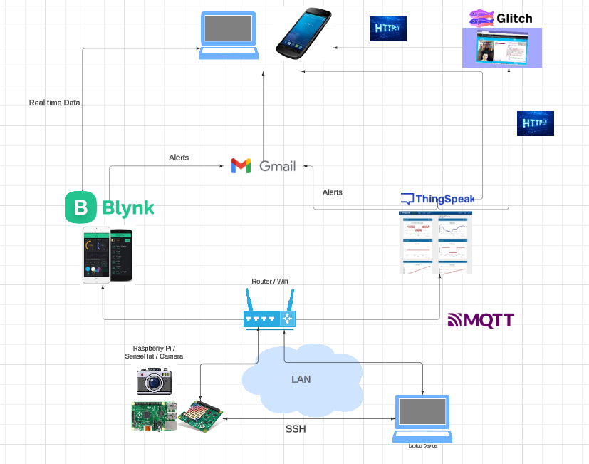

# Smart Care Device

Student Name: Eoin Geoghegan   
Student ID: 20036009

# Where to go

- thingspeak_data.py is the script to run this programme.

# Concept: 
- A monitoring device that could be used in healthcare. The device uses real time data and records data over time using MQTT, ThingSpeak, Blynk, and Glitch.
- Detects falls using accelerometer data. 
- The device monitors the environment temperature and humidity for comfort. 
- The device can take a picture of the environment showing the position of the user. 
- Alerts a family member/carer if a fall happens.

# The idea: 
For this project imagine the device is attached to a persons chest in a fixed position and that it is portable. To create a device that uses the accelerometer to detect if a person has fallen. The accelerometer will be set a certain value that allows for normal day to day movement, sitting/standing/walking. If the device moves at a faster rate than normal, this could indicate that the device itself or the person has fallen. In the event of a suspected fall the device will take a picture of the area in front of the person and send an alert to a family member/carer to check on the individual, the picture can be displayed on the website or mobile phone. The device can also record the temperature and humidity of the envrionment to ensure the person is comfortable. The temperature sensor could also indicate if a person is located inside or outside. The device could be used in a care setting a person can be checked physically by a carer, or in a home setting if a person using the device lives on their own. 
- Added an emergency button(joystick in this case) that sends an alert to mobile phone and email if a person using the device is feeling unwell or has fallen. 

# Ideas down the line: 

- Using GPS to track the indivudual while in commmunity in case of a fall. 
- Live streaming from the device in case of a fall.

## Technologies

Protocols:

- Mqtt: For publishing data to subscribers (Thingspeak + Blynk). Provides Quality of service.
- thingspeak: for monitoring over time; temp, humidity, gyro, accel(in case of a fall but person denies it). Use MATLAB to send alerts to email a family member in case of fall using the gyroscope and accelerometer.
- http: glitch API for photos and thingspeak visuals.
- blynk: mobile app for real time monitoring of temp, humidity, gyro + button to direct to glitch website to see visuals and photos,
- wifi
# Hardware: 
- Raspberry pi, sense hat, raspberry Pi camera.
- Sensors: Accelerometer, temperature and humidity, joystick

# Languages

- python for sensor data, mqtt , http(requests).
- Html, javascript/node for photos and web application.

## Screenshots

- Here is a diagram of how it all works
https://lucid.app/lucidchart/9a8efbbd-9ee6-4d93-b74c-9a9afbe419ff/edit?viewport_loc=-2277%2C-1100%2C2845%2C1275%2C0_0&invitationId=inv_7f010788-2ce9-4dd0-8149-20f291dddce8 

